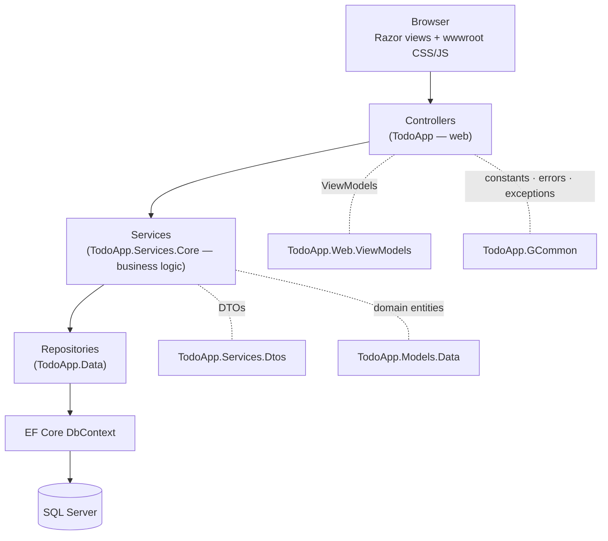

# ToDoApp

A multi-user task manager built on a clean, layered **ASP.NET Core 10 MVC** architecture. Users organise their work into **groups**, manage **todos** through their full lifecycle (create → complete → activate → delete), and view an at-a-glance **dashboard**. Authentication, roles and an admin account are provided by ASP.NET Core Identity.

> **Status:** actively developed. Group and Todo management are complete end-to-end; comments, search/pagination, support messages and an admin panel are on the [roadmap](#roadmap). The backend is covered by **87 passing automated tests**.

- **Stack:** .NET 10 · ASP.NET Core MVC · EF Core 10 · SQL Server · ASP.NET Core Identity
- **Testing:** xUnit · Moq · EF Core InMemory
- **Branch:** `TodoCrudCore` (default: `main`)

---

## Table of contents

- [Features](#features)
- [Architecture](#architecture)
- [Domain model](#domain-model)
- [Project structure](#project-structure)
- [Getting started](#getting-started)
- [Configuration](#configuration)
- [Database & migrations](#database--migrations)
- [Running the app](#running-the-app)
- [Testing](#testing)
- [Design system](#design-system)
- [Roadmap](#roadmap)

---

## Features

| Area | Capability | Status |
|---|---|:--:|
| **Auth** | Register, login, logout, ASP.NET Identity with seeded roles (`Admin`, `User`, `Manager`) + admin account | ✅ Done |
| **Groups** | List, create, edit, delete (cascades the group's todos), delete-confirmation modal | ✅ Done |
| **Todos** | Create (styled form + native date picker), edit, details view, complete, activate, delete | ✅ Done |
| **Todo list** | Group name header, `All` / `Pending` / `Completed` tabs, per-row edit/delete, ordering by priority then due date | ✅ Done |
| **Dashboard** | KPI cards (groups, pending, completed) and an overdue-todos overview | ✅ Done |
| **Responsive UI** | Sidebar on desktop; slide-in **drawer** navigation on mobile/tablet; card-stacked tables | ✅ Done |
| **Comments** | Displayed on the Todo details page | 🟡 Read-only (create/edit/delete planned) |
| **Support messages** | Domain entity, EF configuration and repository | 🟡 Data layer only |
| **Search / filter / pagination** | Todo list search box and pagination controls | 🟠 UI only (no backend yet) |
| **Admin panel** | User/role management, content moderation, audit log | 🟠 Planned |
| **Account recovery** | Forgot/reset password, email confirmation, profile & change-password | 🟠 Planned |

Legend: ✅ done · 🟡 partial · 🟠 planned

---

## Architecture

The solution follows a textbook layered design. A request flows **top-down** through the layers, and each layer only talks to the one directly beneath it:



- **ViewModels** (`TodoApp.Web.ViewModels`) shape data at the web boundary; **DTOs** (`TodoApp.Services.Dtos`) cross the service ↔ repository boundary. The two never leak into each other, keeping the layers decoupled.
- Controllers extend a shared `BaseController` carrying `[Authorize]` + `[AutoValidateAntiforgeryToken]` and a `GetUserId()` helper, so **every action is authenticated and antiforgery-protected by default**.
- Cross-user access is blocked at the service layer — queries are always scoped by the current user's id (and group ownership is verified before any mutation).

---

## Domain model

```
ApplicationUser ─┬─< Group ──< TodoEntity ──< Comment
                 ├─< TodoEntity   (direct owner)
                 └─< SupportMessage
```

**Delete rules** (enforced by EF configuration):

| Relationship | On delete |
|---|---|
| User → Groups, User → Todos | Cascade |
| Todo → Comments | Cascade |
| **Group → Todos** | **NoAction** — deleted in application code (delete todos first, then the group, in one transaction) |

The `Group → Todos` relationship is intentionally `NoAction`: because a Todo is reachable from the User by two paths (directly and via its Group), SQL Server forbids a second cascade path. `GroupService.DeleteGroupAsync` therefore loads the group **with its todos** (ignoring the global query filter so completed todos are included) and removes children before the parent.

A **global query filter** hides completed todos (`Status == Pending`) unless a query explicitly calls `IgnoreQueryFilters()` — this powers the `Pending` vs `All`/`Completed` tabs.

---

## Project structure

```
ToDoApp/
├─ backend/
│  ├─ TodoApp/                     # ASP.NET Core MVC web app — composition root
│  │  ├─ Areas/TodoMainApp/        #   authenticated app: Dashboard, Groups, Todo
│  │  ├─ Controllers/              #   Home, User (register/login/logout)
│  │  ├─ Views/ · wwwroot/         #   Razor views, per-page CSS, site JS
│  │  └─ Program.cs                #   DI, Identity, routing, seeding
│  ├─ TodoApp.Web.ViewModels/      # View models (Todo, Group, User, Comment, Dashboard)
│  ├─ TodoApp.Web.Infrastructure/  # Identity configuration + seeding extensions
│  ├─ TodoApp.Services.Core/       # Business-logic services + contracts
│  ├─ TodoApp.Services.Dtos/       # DTOs crossing the service boundary
│  ├─ TodoApp.Data/                # DbContext, repositories, EF configs, migrations, seeders
│  ├─ TodoApp.Models.Data/         # Domain entities + enums (Priority, Status)
│  ├─ TodoApp.GCommon/             # Shared constants, error messages, exceptions, validation limits
│  └─ TodoApp.Services.Tests/      # xUnit + Moq + EF InMemory test suite (87 tests)
├─ Documents/                      # Project plan & completion roadmap (.docx)
└─ site design/                    # UI reference mockups (auth, home)
```

Nine projects: one web app, and eight class libraries split by responsibility.

---

## Getting started

### Prerequisites

- [.NET 10 SDK](https://dotnet.microsoft.com/download)
- **SQL Server** — LocalDB, Express, or full (or a container)
- EF Core CLI tools:
  ```bash
  dotnet tool install --global dotnet-ef
  ```

### Clone & restore

```bash
git clone <repo-url>
cd ToDoApp/backend
dotnet restore
```

---

## Configuration

**No secrets are committed.** `appsettings.json` ships with empty connection-string and admin fields, so the app will not start until you supply them via **user-secrets** (recommended for local dev) or environment variables. The web project already has a `UserSecretsId`, so the following works out of the box:

```bash
cd backend/TodoApp

# Database connection
dotnet user-secrets set "ConnectionStrings:DevSqlServer" "Server=(localdb)\\MSSQLLocalDB;Database=TodoApp;Trusted_Connection=True;MultipleActiveResultSets=true"

# Seeded admin account (created on first run)
dotnet user-secrets set "Admin:Email" "admin@todoapp.local"
dotnet user-secrets set "Admin:Password" "Admin!2345"
```

The admin password must satisfy the Identity policy in `appsettings.json`: **≥ 8 characters, with upper- and lower-case letters, a digit, a non-alphanumeric character, and ≥ 4 unique characters.**

Identity behaviour (password rules, lockout after 10 failed attempts, unique email) is configurable under the `IdentityConfiguration` section.

---

## Database & migrations

Migrations live in `TodoApp.Data`; the web project is the startup project. Apply them to create the database:

```bash
# from backend/
dotnet ef database update --project TodoApp.Data --startup-project TodoApp
```

On first launch the app **seeds the roles** (`Admin`, `User`, `Manager`) and the **admin account** from your configured credentials. New users who register are automatically placed in the `User` role.

To add a migration after changing an entity:

```bash
dotnet ef migrations add <Name> --project TodoApp.Data --startup-project TodoApp
```

---

## Running the app

```bash
# from backend/
dotnet run --project TodoApp
```

| Profile | URL |
|---|---|
| HTTPS | https://localhost:7151 |
| HTTP  | http://localhost:5246 |

Then register a new account, or log in with the seeded admin credentials.

---

## Testing

The test suite covers repositories (against **EF Core InMemory**), services and controllers (with **Moq**):

```bash
# from backend/
dotnet test
```

> **Note:** if the app is running in Visual Studio, its process locks the build output. Either stop it first, or run
> `dotnet test TodoApp.Services.Tests/TodoApp.Services.Tests.csproj -p:BuildProjectReferences=false`.

What's covered: query filters and ordering, projection/tracking behaviour, the group delete-with-todos flow, DTO/enum/date mapping, exception translation (`EntityNotFoundException` / `DataPersistFail`), and controller ownership guards, status codes and redirect targets.

---

## Design system

The UI uses a small, consistent token set (plain CSS, one stylesheet per page, BEM-style naming):

| Token | Value |
|---|---|
| Brand | `#6C4CFF` (hover `#5b3df0`) |
| Surfaces | white cards, radius `0.875rem`, subtle shadow, `rgba(15,23,42,0.06)` borders |
| Semantic | pending/medium `#F59E0B` · completed/low `#10B981` · high/delete `#EF4444` · edit `#3B82F6` |
| Breakpoint | `48rem` — tables become stacked cards, sidebar becomes a slide-in drawer |

---

## Roadmap

Summarised from `Documents/ProjectCurrentPlan.docx` — a six-phase plan to a deployable product:

1. **Stabilise** — clear remaining review findings; regression tests green.
2. **Finish Todo & Comments** — comment create/edit/delete slice; wire details buttons; list search, filter tabs and pagination.
3. **Complete auth & account** — POST logout with antiforgery; forgot/reset password; email confirmation; profile & change-password.
4. **Admin panel** — a `/Admin` area gated at area level for the `Admin` role: dashboard KPIs, user & role management, content moderation, audit log.
5. **Content & polish** — About / Feedback / Support pages; empty states; accessibility pass.
6. **Harden & ship** — integration tests + CI; secrets via user-secrets/environment; HTTPS/HSTS; deployment config.

**Definition of done:** every capability green; all review findings resolved and covered by tests; Todo and Comment lifecycles fully usable from the UI; complete auth; live Admin panel; secrets externalised; no committed secrets; migrations apply cleanly from a fresh checkout.

---

<sub>Architecture: layered ASP.NET Core MVC (Controller → Service → Repository → EF Core) with ViewModel/DTO isolation and a shared common project. Contributions should slot into the existing layers rather than around them.</sub>
